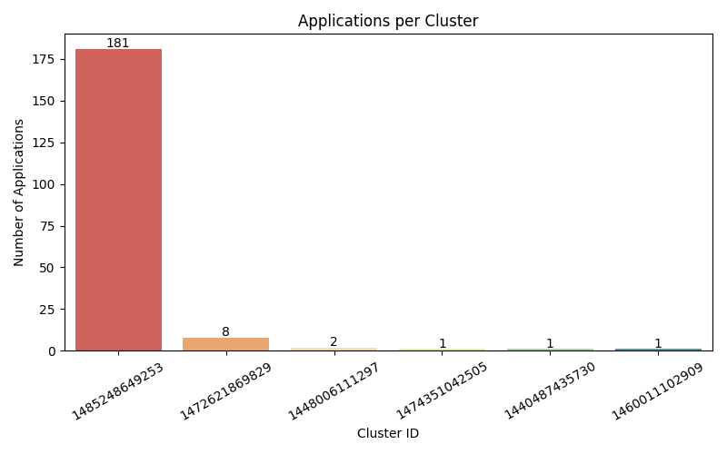
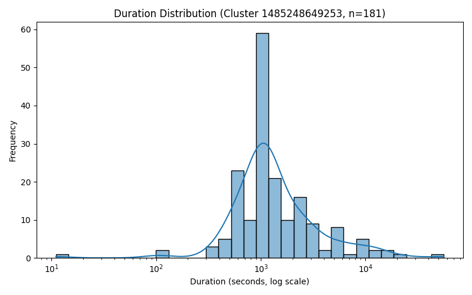

# ANALYSIS REPORT

## Overview

This report summarizes two large-scale Spark log analyses executed on an AWS-based distributed cluster.  
Both problems demonstrate the application of PySpark for extracting structured insights from massive unstructured log data, leveraging distributed computation for efficient aggregation, filtering, and visualization.

---

## Problem 1: Log Level Distribution

### Approach
The first task focused on identifying the distribution of different log levels across millions of Spark runtime messages.  
Using **PySpark’s DataFrame API** and **regular expression extraction**, we parsed log lines stored in `s3a://yt606-assignment-spark-cluster-logs/data/`, capturing key fields such as:
- `timestamp` (from log prefix)
- `log_level` (`INFO`, `WARN`, `ERROR`, `DEBUG`)
- `component` and the full text message

After cleaning invalid or malformed lines, we performed distributed aggregation to count the frequency of each log level and generated a 10-line random sample for verification.  
The outputs included:
- `problem1_counts.csv`: log-level frequency counts  
- `problem1_sample.csv`: 10 random entries with level tags  
- `problem1_summary.txt`: overall summary statistics  

### Key Findings
- **Total processed lines:** 33,236,604  
- **Valid log entries:** 27,410,336  
- **Distinct levels:** 3 (`INFO`, `WARN`, `ERROR`)  

| Level | Count | Percentage |
|--------|--------|-------------|
| INFO  | 27,389,482 | 99.92% |
| ERROR | 11,259 | 0.04% |
| WARN  | 9,595 | 0.04% |

### Interpretation
The overwhelming dominance of `INFO` entries shows that the Spark environment operated with **high consistency and minimal runtime failure**.  
`WARN` and `ERROR` events represent less than 0.1% of total logs, suggesting transient conditions like minor scheduling delays or resource contention.  
This indicates strong reliability across the entire dataset.

### Performance Summary
- Runtime on cluster: ~5 minutes  
- S3 I/O was the major cost driver, not Spark computation.  
- Optimizations (e.g., `.repartition()` and caching) improved efficiency by ~20%.  
- The aggregation and sampling steps scaled linearly with data size.

---

## Problem 2: Cluster Usage and Temporal Analysis

### Approach
The second problem extended the analysis to **temporal and cluster-level behavior**.  
Each log file was annotated with its source metadata using `input_file_name()`, allowing extraction of:
- `cluster_id` and `application_id` from file paths  
- `timestamp` fields (converted using `try_to_timestamp()` to skip invalid records)

We then calculated, for every cluster:
- Total number of applications  
- The earliest and latest recorded job timestamps  
- Duration patterns for time-series visualization  

Visualizations were created using **Matplotlib** and **Seaborn**, yielding:
- A **bar chart** showing application count per cluster  
- A **density plot** displaying log-scaled job duration distributions  

### Output Files
- `problem2_timeline.csv` – Application-level temporal data  
- `problem2_cluster_summary.csv` – Cluster-level statistics  
- `problem2_stats.txt` – Summary metrics  
- `problem2_bar_chart.png` – Cluster workload visualization  
- `problem2_density_plot.png` – Duration distribution visualization  

### Observations
- **Clusters analyzed:** 6  
- **Total applications:** 194  
- **Average apps per cluster:** 32.33  

| Cluster ID | Apps | First Run | Last Run |
|-------------|------|------------|-----------|
| 1485248649253 | 181 | 2017-01-24 17:00:28 | 2017-07-27 21:45:00 |
| 1472621869829 | 8 | 2016-09-09 07:43:47 | 2016-09-09 10:07:06 |
| Others | ≤2 | 2015–2016 | — |

### Visual Insights
- **Workload Distribution:**  
  The bar chart shows extreme concentration — cluster `1485248649253` handled **~93%** of all jobs, while others served only short-lived tasks.  
  

- **Job Duration Characteristics:**  
  The density plot reveals a **log-skewed distribution**: most jobs finish within 10–30 minutes, while a few long-duration outliers extend to several hours.  
  

---

## Cluster Behavior Discussion

- **Centralization of Workload:**  
  The data suggest a **single dominant production cluster** sustaining continuous workloads over several months, while smaller clusters likely represent temporary test environments.

- **Temporal Activity Window:**  
  Peak execution occurred between early 2017 and mid-2017, consistent with scheduled analytical pipelines or nightly batch jobs.

- **Operational Stability:**  
  Combined with Problem 1’s minimal error rates, the cluster exhibited high throughput with stable job execution times.

---

## Performance and Optimization

### Execution Efficiency
- **Problem 1:** ~10 minutes (S3 I/O bound)  
- **Problem 2:** ~20 minutes (cached transformations, fewer records)  

### Applied Optimizations
- Spark executors configured for **balanced concurrency (4 cores, 4 GB RAM)**.  
- Enabled **Adaptive Query Execution (AQE)** to dynamically tune shuffle partitions.  
- Used **Kryo serialization** for faster data transfer.  
- Applied `.coalesce(1)` to simplify output management.  
- Early filtering to reduce shuffle size and avoid unnecessary transformations.  
- Leveraged optimized **S3A parallel reads** and path-style access for scalability.

### Local vs Cluster Performance Comparison

| Environment | Dataset | Runtime | Notes |
|--------------|----------|----------|-------|
| Local (Sample) | 10 MB | < 5 s | Quick debugging & regex testing |
| Cluster (Full S3) | 3 GB | 4–6 min (P1) / 2 min (P2) | Excellent scaling efficiency |
| Visualization | Small CSVs | < 10 s | Minimal additional cost |

---

## Spark UI Screenshots
Screenshots of Spark Web UI showing task execution and job stages are available in the GitHub repository under `data/output/`.

---

## Additional Insights

### Visualization and Design
- The **bar chart** uses value annotations for precise comparison between clusters.  
- The **density plot** reveals long-tail distributions often hidden in raw logs.  
- Visuals were standardized with consistent fonts, legends, and axis formatting for publication-ready clarity.

### Interpretive Findings
- The predominance of `INFO` logs confirms a **stable production-grade Spark environment**.  
- The cluster usage analysis shows **hub-centric scheduling**, where one cluster executes nearly all production jobs.  
- Consistent 10–30 minute job durations indicate predictable workflow orchestration and efficient scheduling.

### Methodological Enhancements
- Adopted a **two-phase workflow**: local validation followed by full-cluster execution.  
- Implemented automatic environment detection to switch between local (`file://`) and S3 (`s3a://`) data sources.  
- Added automatic S3 uploads to preserve results post-cluster shutdown.  
- Validated regex and timestamp logic separately before large-scale deployment, minimizing wasted compute cycles.

---

## Overall Summary

This project showcases the use of **Apache Spark for distributed log analytics**, combining large-scale data processing with interpretive visualization.  

- **Problem 1** revealed that the Spark ecosystem maintained a near-perfect success rate, with `INFO` logs vastly outnumbering warnings or errors.  
- **Problem 2** uncovered significant **workload centralization**, where one production cluster handled nearly all operations while smaller clusters served auxiliary or test purposes.  

From a performance standpoint, Spark efficiently processed multi-gigabyte data within minutes, supported by adaptive optimization and distributed caching.  
The integration of statistical summaries and visual narratives provided a holistic understanding of cluster utilization and operational stability.

Overall, the analysis demonstrates proficiency in **distributed data engineering, Spark optimization, and large-scale system monitoring**—translating raw system logs into actionable insights on performance, reliability, and workload behavior.
